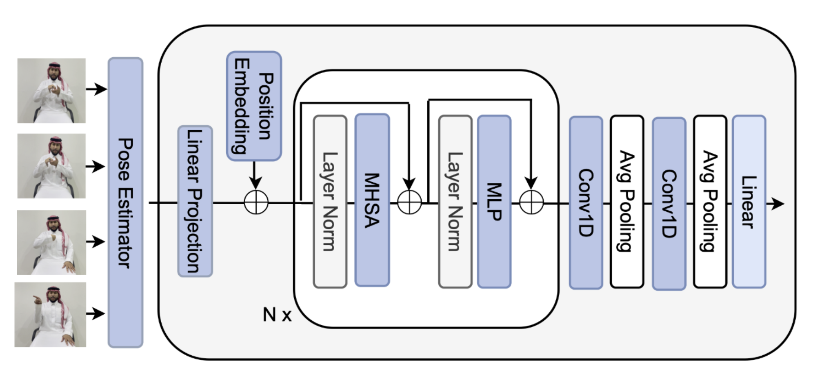

# Pose Estimation for MSLR CSLR Track

Welcome to the Pose Estimation repository! This repository contains the starter kit for the **MSLR CSLR Track** and provides a simple baseline for two important tasks in Continuous Sign Language Recognition (CSLR).

The tasks include:
1. **Signer Independent** [View Competition](https://www.kaggle.com/competitions/continuous-sign-language-recognition-iccv-2025)
2. **Unseen Sentences** [View Competition](https://www.kaggle.com/competitions/continuous-slr-task-2-iccv-2025)

## Baseline Overview

We use a simple **Transformer model** to produce the baseline for these tasks. The architecture of the baseline model is shown below:



| Task              | Baseline |
|-------------------|----------|
| **Signer Independent** | [Baseline] |
| **Unseen Sentences**    | [Baseline] |

## Setup Instructions

Follow these steps to set up the environment and get started:

1. **Clone the repository**:
   ```bash
   git clone <repo-url>
   cd <repo-folder>
   ```

2. **Download the dataset** from [here](https://www.kaggle.com/competitions/continuous-sign-language-recognition-iccv-2025/data). Place the dataset in the `./data` folder.

3. **Set up the Python environment**:
   - Install `virtualenv`:
     ```bash
     pip install virtualenv
     ```

   - Create a virtual environment and activate it:
     ```bash
     python<version> -m venv pose
     source pose/bin/activate  # On Windows: pose\Scriptsctivate
     ```

   - Install the necessary dependencies:
     ```bash
     pip install -r requirements.txt
     ```

## Usage

Once the environment is set up, you can train or test the model on the available tasks. Follow the instructions in the individual task directories for specific commands.

## License

This project is licensed under the MIT License.
